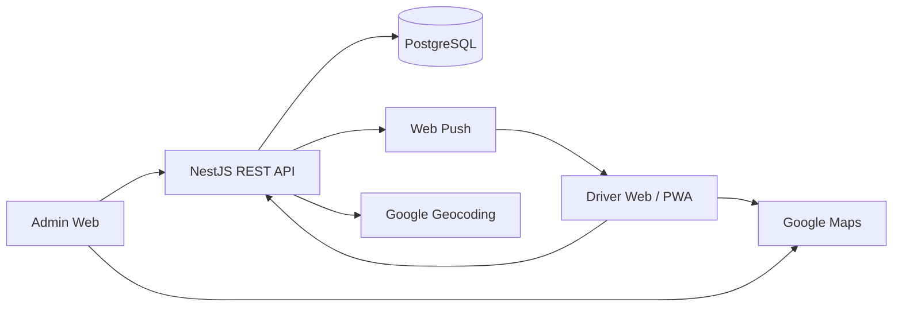

# SquidFlow

派單|接單|管理系統

Admin creates and publishes ride requests; eligible Drivers claim, execute, and complete orders. Phase 1 covers core dispatch; Phase 2 adds location, geocoding, distance, and maps.

---

## Project Overview

SquidFlow is an order dispatch and claim management system for a private driver fleet.

**Core flow**

```text
Admin receives a ride request
  → creates & publishes an order
  → eligible Drivers are notified
  → Drivers view and claim
  → first successful claim wins
  → trip starts → order completed
```

| Role | Responsibilities |
|------|------------------|
| **Admin** | Manage drivers, create / publish / cancel orders, monitor fleet & orders |
| **Driver** | Go online / offline, claim open orders, start & complete assigned trips |

---

## Key Features

**Admin / Driver**
- Role-based Admin and Driver experiences (Web / PWA for Drivers)

**Order Lifecycle**
- `DRAFT` → `OPEN` → `ACCEPTED` → `IN_PROGRESS` → `COMPLETED` (plus `CANCELLED`)

**Multi-driver atomic claim**
- Concurrent Drivers may attempt to claim the same open order; only one succeeds

**Driver GPS**
- Location updates while online; Admin can view latest online-driver positions

**Pickup Geocoding**
- Server-side Google Geocoding for pickup coordinates (transient; not persisted)

**Distance**
- Straight-line distance from Driver to Pickup (assistive; not road distance / ETA)

**Google Maps**
- In-app map display and external Google Maps navigation handoff

**Web Push**
- Push notifications to Drivers for new open orders

**Authentication / RBAC / Rate Limiting**
- Session-based auth, Admin / Driver authorization, rate limits on high-risk APIs

---

## Engineering Highlights

- **Claim uniqueness at the Backend / Database** — atomic conditional updates ensure only one Driver wins a race
- **Order concurrency control** — status transitions guarded so invalid or stale updates cannot corrupt state
- **Modular Monolith** — NestJS modules with a single deployable backend; business rules enforced server-side
- **Spec-driven development** — product, API, DB, architecture, and security defined under `docs/` before implementation
- **Testing & audit** — unit / e2e coverage for critical paths (auth, order state, claim races); security hardening for production readiness
- **AI-assisted development with Cursor** — Spec → implementation → test → audit workflow accelerated with Cursor

---

## Tech Stack

| Layer | Stack |
|-------|--------|
| Frontend | Vue 3, Vite, TypeScript, Vue Router, Pinia, Naive UI |
| Backend | Node.js, NestJS, TypeScript |
| Database | PostgreSQL, Prisma |
| API | REST |
| Notifications | Web Push |
| Maps / Geo | Google Geocoding API, Google Maps JavaScript API |
| Architecture | Modular Monolith |

---

## High-level Architecture



Frontend talks only to the REST API. The backend owns business logic, persistence, geocoding, and push delivery.

---

## Development Approach

```text
Spec → Implementation → Test → Audit
```

1. Read and align with `docs/` specifications  
2. Implement against Spec (no silent product / schema drift)  
3. Cover critical paths with automated tests  
4. Review and audit (correctness, concurrency, security)

---

## Project Documentation

| Spec | Description |
|------|-------------|
| [MVP-SPEC.md](docs/MVP-SPEC.md) | Phase 1 product scope & order rules |
| [PHASE-2-SPEC.md](docs/PHASE-2-SPEC.md) | Location, geocoding, distance, maps |
| [TECHNOLOGY-SPEC.md](docs/TECHNOLOGY-SPEC.md) | Tech choices & constraints |
| [DATABASE-SPEC.md](docs/DATABASE-SPEC.md) | Schema & data rules |
| [API-SPEC.md](docs/API-SPEC.md) | REST API contract |
| [UI-UX-SPEC.md](docs/UI-UX-SPEC.md) | UI / UX requirements |
| [SYSTEM-ARCHITECTURE-SPEC.md](docs/SYSTEM-ARCHITECTURE-SPEC.md) | System architecture |
| [SECURITY-SPEC.md](docs/SECURITY-SPEC.md) | Auth, RBAC, hardening |

See also [DEVELOPMENT-STATUS.md](docs/DEVELOPMENT-STATUS.md) for implementation progress.
